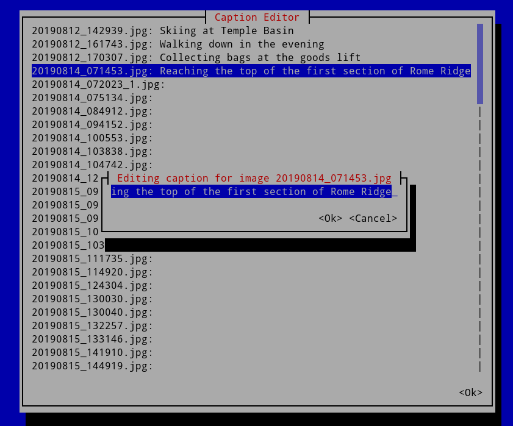

# photo-captioner [](https://crates.io/crates/photo-captioner) [](https://github.com/kellpossible/photo-captioner/blob/master/LICENSE.txt)

This is a command line application to aid in the creation and editing of captions for a gallery of images.



Install:
```
cargo install photo-captioner
```

Command Line Options:
```
USAGE:
    photo-captioner [FLAGS] [OPTIONS] [--] [gallery-dir]

FLAGS:
    -e, --edit       whether or not to edit the captions
    -h, --help       Prints help information
    -V, --version    Prints version information

OPTIONS:
    -n, --output-name <output-name>
            The name of the output file (if there is one). Will be "captions.csv" by default for the "csv" output-type.

    -t, --output-type <output-type>                   The type of output, available options: "csv" [default: csv]
    -c, --view-command <view-command>
            The command used to launch an image viewer upon editing the caption for an image in order to view the image
            who's caption is being edited
    -a, --view-command-args <view-command-args>...
            The command used to launch an image viewer upon editing the caption for an image in order to view the image
            who's caption is being edited. Escape dash "-" symbols with a backslash: "\-". For example: -a "\-\-some"
            "command"

ARGS:
    <gallery-dir>    Directory of the gallery to generate captions for
```

CSV output file:
```csv
Image,Caption
image_filename.jpg,caption
```

## Building on Windows

Building on Windows currently requires you to select a [different backend](https://github.com/gyscos/cursive/wiki/Backends) for the [cursive](https://github.com/gyscos/cursive) library. Target specific default features doesn't appear to be well supported in cargo/rust at the moment.

You have a few choices, but the one with the least effort required to setup is the [crossterm](https://github.com/TimonPost/crossterm) library. To select this for building use the command:

```sh
cargo build --no-default-features --features crossterm-backend --release
```

## Example

Using the [feh](https://feh.finalrewind.org/) image viewer to preview images while editing captions, and scale them nicely to fit the screen.

```
photo-captioner -e -c "feh" -a "\-\-scale-down" "\-B" "black" -- /photo/gallery/path
```

Using Windows Explorer image viewer on Windows to preview images:

```
photo-captioner -e -c "explorer.exe" -- /photo/gallery/path
```

## Features

Features available are ticked, todo items remain unchecked until completed.

 - [x] generate captions.csv file in gallery directory
 - [x] gui (terminal ui) editor for editing captions
 - [x] update captions.csv with new images
 - [ ] write/read to jpg exif